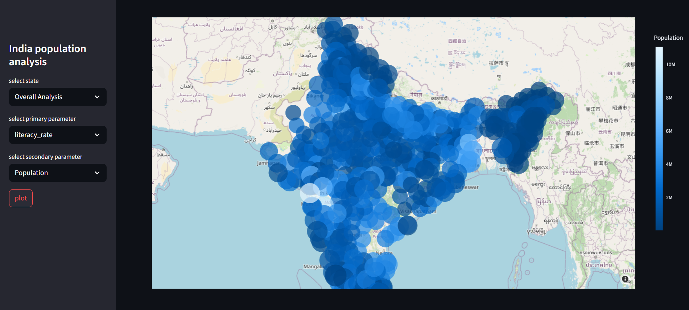

## Indian Census 2011 Dashboard


This interactive dashboard visualizes key demographic indicators from the Indian Census 2011 dataset using Plotly. The dashboard displays literacy rates, male/female literacy statistics, population distribution, and sex ratio across Indian states and union territories.

## Features
🗺️ Interactive choropleth map of India

📊 Visualizations for six key census metrics:

- Literacy Rate

- Female Literacy

- Male Literacy

- Population

- Sex Ratio


📈 Hover tooltips showing detailed statistics

🎨 Color-coded visualization based on metric values

🔍 Zoom and pan functionality

📱 Responsive design that works on desktop and mobile devices

### Requirements
Python 3.7+

Plotly

Pandas

Dash (for web deployment)

## Installation
Clone the repository:

```
git clone https://github.com/Sumit0x00/plotly-dashboard.git
cd plotly-dashboard
```

## Usage

- Run the dashboard locally:

```
python app.py
```
Then open your browser and navigate to:


http://localhost:8050/
Data Sources
The dashboard uses the Indian Census 2011 dataset which includes:

State-wise population data

Literacy rates by gender

Sex ratio statistics

Working population metrics
